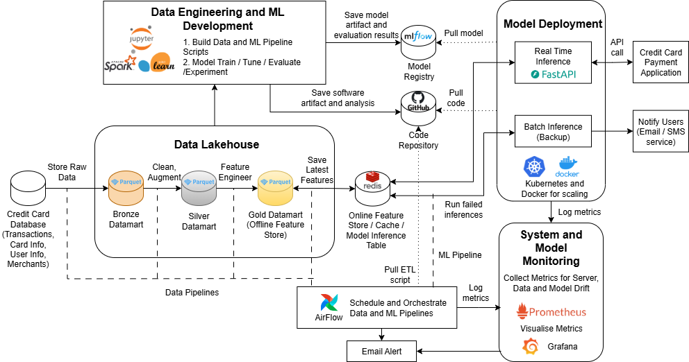
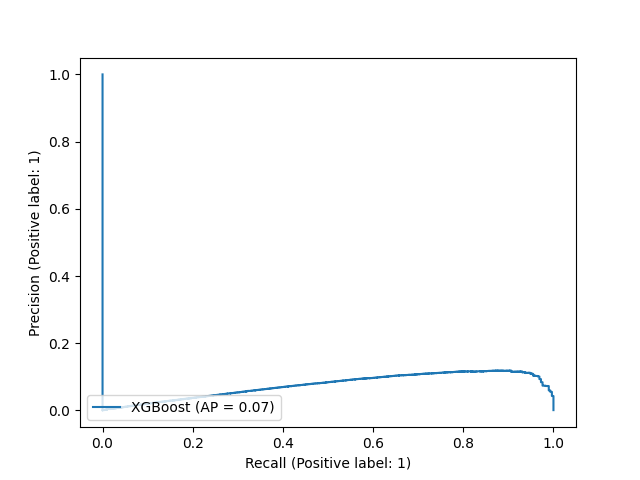
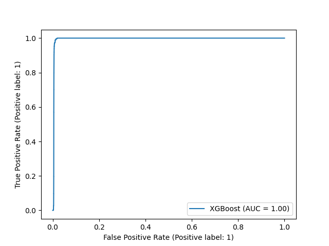
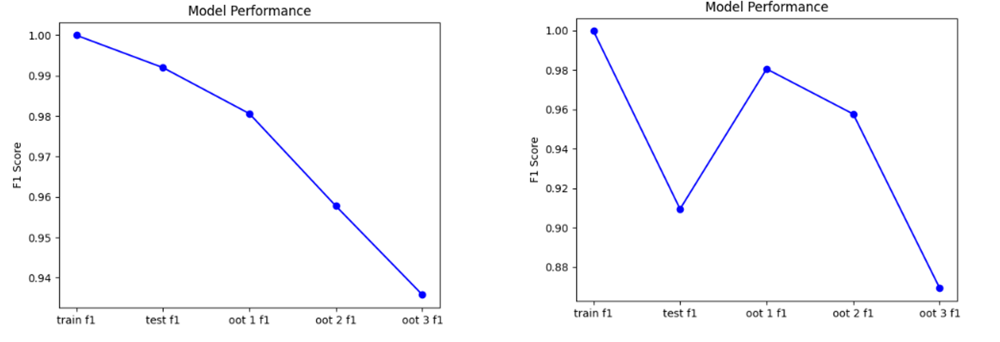
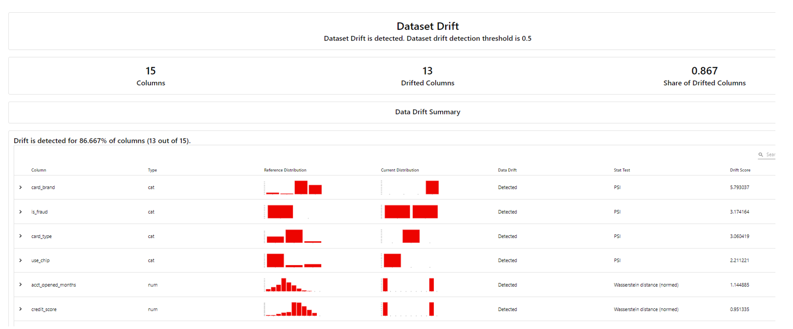
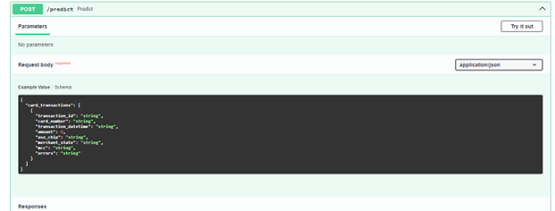
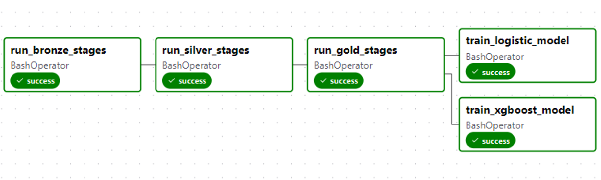

# Payment Card Fraud Detection — End-to-End ML Pipeline

> A production-style machine learning system for detecting potentially fraudulent payment card transactions and supporting risk-based operational decisions across fraud operations, risk, and compliance teams.

---

## Overview

This repository implements a production-style machine learning pipeline for payment card fraud detection, designed to support the operational decisions of fraud operations analysts and risk teams. It spans the full workflow from PySpark-based Medallion ETL and feature engineering to model training, out-of-time evaluation, MLflow experiment tracking, FastAPI inference, Redis-backed feature serving, EvidentlyAI drift monitoring, Airflow orchestration, and Docker Compose-based local infrastructure. The project is presented as an applied portfolio system for a real-world enterprise risk problem.

---

## Why This Project Matters

Payment card fraud creates significant financial loss, customer trust issues, and regulatory exposure for financial institutions. Traditional rule-based systems struggle to keep pace as fraud patterns evolve, making machine learning a practical approach for improving detection while balancing operational workload and customer friction.

But fraud detection is not simply a modelling problem. It is an **operational tradeoff problem**:

- Every **missed fraud** (false negative) represents a direct financial loss
- Every **false alarm** (false positive) creates unnecessary investigation work for fraud analyst teams and degrades the cardholder experience

The goal is not maximum accuracy, but the right balance between fraud detection sensitivity and false alarm control as fraud patterns change over time.

---

## Business Problem and Operational Decision Context

### The risk problem

Payment card fraud creates asymmetric costs. Missed frauds lead to direct financial loss, write-offs, and potential regulatory liability. False alarms — flagging legitimate transactions as fraudulent — create investigation overhead for fraud analyst teams and introduce friction for cardholders. These two error types pull in opposite directions and cannot both be minimised simultaneously.

### The operational decision

For each incoming card transaction, the system produces a binary fraud / non-fraud prediction intended to feed a downstream decisioning workflow: block, flag for analyst review, or pass. The model is a decision-support tool, not a replacement for human judgement — it prioritises the analyst queue and surfaces the transactions most likely to warrant investigation.

### Stakeholder context

| Stakeholder | Primary concern |
|---|---|
| **Fraud operations analysts** | Catching real fraud without drowning in false alarms — workload and accuracy |
| **Risk teams** | Confidence that the model generalises over time as fraud patterns shift |
| **Compliance teams** | Auditability of model inputs, predictions, and monitoring indicators |
| **Card operations / product** | False positive rate and its impact on cardholder experience |

### The detection challenge

Fraud events represent approximately **0.15% of all transactions** in this dataset — a severe class imbalance that makes standard accuracy metrics meaningless and demands careful attention to both training strategy and evaluation design. A model that flags nothing as fraudulent would achieve 99.85% accuracy while being entirely useless.

---

## Solution Overview

The system is structured as four coordinated pipelines, orchestrated by Apache Airflow and containerised via Docker Compose:

1. **Data Processing Pipeline** — Ingests and transforms raw financial data through a three-layer Medallion architecture (Bronze → Silver → Gold), producing ML-ready feature and label stores partitioned by date
2. **Machine Learning Pipeline** — Preprocesses features, handles class imbalance, trains and tunes models against a time-aware held-out evaluation design, and registers the best model in MLflow
3. **Inference Pipeline** — Serves real-time fraud predictions via a FastAPI endpoint, assembling features from a Redis online feature store and the incoming transaction payload
4. **Monitoring Pipeline** — Detects feature drift between the training reference distribution and live inference data, providing early warning of potential model degradation before confirmed label-based metrics are available

---

## Key System Capabilities

**Data Engineering**
- Three-layer Medallion ETL (Bronze / Silver / Gold) using PySpark for scalable, reproducible transformation of raw transaction, card, user, and merchant data
- Offline Gold feature store: date-partitioned Parquet snapshots for reproducible model training and time-based evaluation
- Online Redis feature store: low-latency card and customer profile retrieval at inference time
- Schema enforcement, null handling, and data quality validation across all pipeline layers

**Model Training and Evaluation**
- Multi-model comparison: Logistic Regression, XGBoost, and MLP — with documented rationale for selection and rejection
- SMOTE oversampling applied post-split to the training set only, preventing synthetic samples from leaking into evaluation sets
- Optuna hyperparameter tuning with F1 as the optimisation objective
- Sequential out-of-time (OOT) validation across multiple held-out windows, testing temporal generalisation rather than in-sample fit
- Full experiment tracking, artifact logging, and model versioning via MLflow

**Inference and Serving**
- FastAPI real-time inference endpoint with health check, prediction logging, and structured JSON response
- Redis online feature store for fast card and customer profile retrieval at scoring time
- Training/inference feature consistency: time-dependent features recomputed relative to the transaction date at both training and inference time, preventing training/serving skew

**Monitoring and Operational Reliability**
- EvidentlyAI data drift detection using Population Stability Index (PSI) — an established standard in credit-risk analytics, readable by auditors
- Feature drift used as a leading indicator of concept drift, since confirmed fraud labels arrive with significant delay due to chargeback investigation cycles
- Drift flagged when a material proportion of feature columns show significant distribution shift
- Prediction results logged with timestamps for downstream auditing and replay
- Airflow email alerts on all pipeline task success and failure events

**Orchestration and Infrastructure**
- Apache Airflow 3.0 DAGs for scheduling, dependency management, and operational visibility
- Docker Compose environment with 8 services covering all pipeline components
- Modular, container-isolated architecture supporting independent pipeline execution and updates

---

## Key Technical Decisions

Four design choices reflect domain-aware reasoning about fraud detection:

- **Out-of-time validation over shuffled cross-validation.** Fraud patterns shift as fraudsters adapt over time. Shuffled cross-validation tests in-sample pattern recall; OOT validation tests whether the model generalises to future data — the only performance that matters operationally. Data is sorted chronologically and multiple sequential OOT windows are evaluated before any training split occurs.

- **SMOTE applied after the train/test split.** Synthetic minority-class (fraud) samples are generated for the training set only. Applying SMOTE before splitting would allow synthetic fraud examples into evaluation sets, inflating apparent performance — a common and consequential implementation error.

- **F1 as the hyperparameter tuning objective.** Raw accuracy is meaningless at 0.15% fraud prevalence. F1 directly optimises the balance between catching actual fraud (recall, which drives down financial loss) and keeping analyst investigation workload manageable (precision, which limits false alarms). XGBoost additionally encodes asymmetric error costs via a class weight parameter that penalises missed frauds more heavily than false alarms.

- **Feature drift as the primary monitoring signal.** Confirmed fraud labels from chargeback investigations arrive days or weeks after transactions. Waiting for label-based accuracy metrics means reacting to degradation that has already occurred. Feature distribution drift, measurable as soon as inference data accumulates, serves as a forward-looking proxy that enables proactive retraining.

---

## End-to-End Pipeline Workflow

### 1. Raw Data Ingestion — Bronze Layer

Five source files are ingested via PySpark: a 13-million-row transactions CSV, cards metadata, user profiles, MCC merchant category codes, and fraud labels. Large JSON files are streamed in batches to manage memory. Transactions are partitioned by snapshot date. No transformations occur — Bronze is a faithful, schema-preserving landing zone.

### 2. Cleaning and Standardisation — Silver Layer

Each Bronze table is independently cleaned using PySpark:
- Date strings parsed to typed `DateType` fields; currency symbols stripped from financial columns
- Null values handled semantically — online transactions with no physical merchant location fill `"online"` rather than null
- Categorical columns lowercased and trimmed; all schemas explicitly cast and enforced

### 3. Feature Engineering — Gold Layer

Silver tables are joined: transactions → user profiles (on client ID) → cards (on card ID) → MCC codes (on merchant category code). Two time-dependent features are engineered:

- **`acct_opened_months`** — Account tenure in months relative to the transaction date; a proxy for account maturity
- **`yrs_since_pin_changed`** — Years since PIN was last changed relative to the transaction year; a proxy for account security hygiene

Both features are computed relative to the **transaction date**, not today's date, so each record reflects the account state at the time of purchase. This is preserved in the inference pipeline to prevent training/serving skew.

Gold-layer snapshots are persisted as date-partitioned Parquet in an offline feature store; fraud labels are stored separately and joined at training time by transaction ID.

### 4. Online Feature Store Population

Card and user profile data from the Silver layer is loaded into Redis, keyed by card number, enabling the inference API to retrieve attributes without re-joining tables at query time.

### 5. Model Training

Gold-layer snapshots are loaded by date range, preprocessed (mean/most-frequent imputation, one-hot encoding, standard scaling), and split chronologically. OOT windows are carved from the tail before the train/test split — the model is never exposed to future data during training. SMOTE is applied to the training split only.

Three model types were evaluated:
- **Logistic Regression** — interpretable and fast at inference; effective with well-engineered features
- **XGBoost** — robust to class imbalance via sequential tree learning; each tree corrects errors on hard-to-classify examples (rare fraud events); fast inference
- **MLP** — dropped early due to inference latency constraints for real-time scoring

### 6. Hyperparameter Tuning

Optuna searches each model's hyperparameter space, optimising for F1 score. A champion-tracking callback logs only improving trials, keeping the MLflow experiment record clean. All parameters, metrics, confusion matrices, and the final model artifact are logged to MLflow.

### 7. Model Registration

The best-performing model — packaged as a single scikit-learn `Pipeline` containing both the preprocessing transformations and the trained estimator — is registered in the MLflow model registry and tagged with the alias `"best"`. The inference container resolves this alias at startup, enabling model swaps without container redeployment.

### 8. Real-Time Inference

When a prediction request arrives at the `/predict` endpoint, the API:
1. Retrieves card and customer profile data from Redis using the card number as the lookup key
2. Merges profile data with transaction fields from the request payload
3. Recomputes time-dependent features relative to the transaction datetime
4. Passes the assembled feature set to the pre-loaded MLflow model
5. Returns a binary `is_fraud` flag per transaction ID
6. Logs predictions to a monitoring CSV and a timestamped Redis key for auditing

### 9. Drift Monitoring

EvidentlyAI compares the reference training distribution — saved by the preprocessing step at training time — against accumulated inference data. PSI is applied for feature drift detection. Reports are generated in an EvidentlyAI Workspace and accessible via a monitoring dashboard. Feature drift serves as a leading indicator of concept drift where confirmed fraud labels are not immediately available.

### 10. Orchestration

Apache Airflow DAGs manage execution order and dependencies across all pipeline stages. Email notifications are sent on task success and failure. Pipelines can be run independently or as a combined ETL and ML training workflow via a single DAG.

---

## Architecture

<p align="center">
  
</p>
<p align="center">
  <em>Four coordinated pipelines — data processing, model training, inference, and monitoring — orchestrated by Apache Airflow and containerised via Docker Compose.</em>
</p>

| Component | Role | Location |
|---|---|---|
| **Bronze ETL** | Raw file ingestion → partitioned Parquet; no transformation | `etl/bronze_layer.py` |
| **Silver ETL** | Schema enforcement, type casting, null handling, normalisation | `etl/silver_layer.py` |
| **Gold ETL + Offline Feature Store** | Multi-table join, feature engineering, date-partitioned Parquet output | `etl/gold_layer.py` |
| **Online Feature Store** | Redis population with card + user profiles keyed by card number | `etl/online_feature_layer.py` |
| **ML Training Pipeline** | Preprocessing, SMOTE, model training, Optuna tuning, OOT evaluation | `ml/` |
| **MLflow** | Experiment tracking, model versioning, model registry with alias-based resolution | Docker: `mlflow` |
| **FastAPI Inference API** | Real-time prediction endpoint with Redis feature retrieval and prediction logging | `inference/app.py` |
| **Redis** | Online feature store (db 0) + timestamped prediction log (db 1) | Docker: `redis` |
| **EvidentlyAI Monitoring** | PSI-based feature drift detection with workspace report archiving | `monitoring/monitoring.py` |
| **Apache Airflow** | DAG orchestration, scheduling, email alerting | `airflow/dags/` |
| **Docker Compose** | Full 8-service local infrastructure definition | `docker-compose.yml` |

### Planned Deployment Roadmap

A phased model deployment strategy has been designed for production rollout (not yet implemented in the current codebase):

| Phase | Description |
|---|---|
| **Shadow mode** | Model scores live transactions without influencing decisions; outputs validated against historical labels before any production impact |
| **Canary rollout** | Traffic gradually shifted from existing to new model (small initial percentage, increasing to 100%) while monitoring key performance indicators |
| **Full deployment** | Complete traffic migration with continuous feature and prediction drift monitoring active |

---

## Evaluation and Operational Tradeoffs

### Why F1 is the primary metric

At a fraud rate of 0.15%, a model that flags nothing as fraud achieves 99.85% accuracy — while being operationally worthless. What matters is the balance between:

- **Recall** (fraud detection rate): catching actual fraud; every missed fraud is a direct financial loss
- **Precision** (false alarm rate): keeping investigation workload manageable; excessive false alarms degrade analyst efficiency and cardholder experience

F1 score — the harmonic mean of precision and recall — was selected as the primary metric and tuning objective, balancing detection sensitivity against false alarm minimisation under severe class imbalance. Precision-Recall and ROC curves are committed to the repository from a completed training run.

Due to extreme class imbalance, ROC performance appears strong while Precision-Recall performance reflects the practical challenge of maintaining precision at higher recall levels.

<table align="center" style="border-collapse: collapse;">
  <tr>
    <td align="center" style="padding: 0 0px;">
      <br>
      <sub>Precision-Recall Curve</sub>
    </td>
    <td align="center" style="padding: 0 0px;">
      <br>
      <sub>ROC Curve</sub>
    </td>
  </tr>
</table>

<p align="center"><i>Precision-Recall and ROC curves from a completed training run.</i></p>

### How class imbalance is handled

Two complementary strategies address the 0.15% fraud rate:

- **SMOTE**: Generates synthetic fraud examples during training to expose the model to a more balanced distribution. Applied after the train/test split to prevent synthetic samples from contaminating evaluation sets.
- **Class weight adjustment**: XGBoost is configured with a positive class weight parameter that penalises missed frauds more heavily than false alarms, encoding the asymmetric cost of the two error types into the model's objective.

### Time-aware evaluation — out-of-time validation

Fraud patterns shift as fraudsters adapt their behaviour. Cross-validation on shuffled data measures in-sample pattern recognition, not forward generalisation.

The evaluation uses a **sequential out-of-time (OOT) design**: data is sorted chronologically, multiple OOT windows are carved from the most recent end of the dataset before any train/test split, and the model is evaluated independently on each window. F1 is tracked across train → test → OOT windows to surface temporal degradation or instability. The training window spans 12 months of history; three sequential OOT windows test forward generalisation.

### Model comparison and selection

Three models were evaluated. The key differentiator was temporal stability, not peak performance:

| Model | Temporal Behaviour | Deployment Decision |
|---|---|---|
| **XGBoost** | Most stable across OOT windows — smooth, gradual degradation with no overfitting | **Selected** |
| Logistic Regression | Greater variance across OOT windows — less reliable under temporal shift | Not selected |
| MLP | Dropped due to real-time inference latency constraints | Not selected |

XGBoost was selected as the champion model not only because of smoother temporal degradation, but also because it achieved the stronger reported final OOT F1 score (93% vs. 87% for Logistic Regression).

<p align="center">
  
</p>
<p align="center">
  <em>Model performance across train, test, and sequential out-of-time windows.</em><br>
  <em>XGBoost showed smoother degradation under temporal shift and was selected as the deployment candidate.</em>
</p>

### Monitoring thresholds and alerting

Since confirmed fraud labels typically arrive with significant delay due to chargeback investigation cycles, the system uses **feature drift as a leading indicator** of potential concept drift. Dataset drift is flagged when a material proportion of feature columns show significant distribution shift. Once ground-truth labels become available, accuracy-based monitoring provides a second alerting layer with a lead-time buffer before the business-critical threshold.

<p align="center">
  
</p>
<p align="center">
  <em>EvidentlyAI dashboard showing dataset drift detection between reference training data and live inference data.</em>
</p>

---

## Tech Stack

| Category | Technology |
|---|---|
| Data Processing | PySpark, Pandas, PyArrow, ijson |
| ML Framework | scikit-learn, XGBoost, imbalanced-learn (SMOTE) |
| Hyperparameter Tuning | Optuna |
| Experiment Tracking & Registry | MLflow 3.1 |
| Inference API | FastAPI, Uvicorn |
| Online Feature Store | Redis |
| Drift Monitoring | EvidentlyAI |
| Orchestration | Apache Airflow 3.0 |
| Infrastructure | Docker, Docker Compose |
| Storage | Parquet (offline features), Redis (online features + predictions), PostgreSQL (Airflow metadata) |

---

## Implementation Highlights

**Architecture and diagrams**
- `assets/end2end.png` — end-to-end system architecture diagram

**Data pipeline (full implementation)**
- `etl/bronze_layer.py` — PySpark Bronze ingestion with streaming JSON handling and date partitioning
- `etl/silver_layer.py` — PySpark Silver cleaning, schema enforcement, and null handling
- `etl/gold_layer.py` — PySpark Gold join, feature engineering, and offline feature store population
- `etl/online_feature_layer.py` — Redis online feature store population with type-safe serialisation
- `etl/notebooks/refined_eda.ipynb` — EDA and feature validation notebook

**Model training and evaluation**
- `ml/preprocessor.py` — OOT splitting, SMOTE, sklearn Pipeline construction, reference data export
- `ml/model_manager.py` — Optuna study, MLflow nested run logging, OOT evaluation, confusion matrix logging
- `ml/data_loader.py` — Gold Parquet loader with date-range filtering and label join
- `ml/optuna_config/` — per-model hyperparameter search space definitions (XGBoost, Logistic Regression, MLP)
- `ml/scripts/Test_pr_curve.png` — Precision-Recall curve from a completed training run
- `ml/scripts/Test_roc_curve.png` — ROC curve from a completed training run

**Inference API**
- `inference/app.py` — FastAPI application with `/health` and `/predict` endpoints, Redis feature retrieval, and prediction logging
- `example_inference_input.txt` — example POST payload for the inference endpoint

<p align="center">
  
</p>
<p align="center">
  <em>FastAPI <code>/predict</code> endpoint for scoring transaction batches through the inference pipeline.</em>
</p>

**Drift monitoring**
- `monitoring/monitoring.py` — EvidentlyAI drift detection with PSI and Workspace report archiving
- `monitoring/monitor_conf.yaml` — monitoring configuration

**Orchestration**
- `airflow/dags/` — 6 Airflow DAGs covering data processing, ML training, inference, online feature population, and monitoring pipelines, with email alerting

<p align="center">
  
</p>
<p align="center">
  <em>Airflow DAG execution for the ETL-to-training workflow, from Bronze / Silver / Gold processing to parallel model training.</em>
</p>

**Infrastructure**
- `docker-compose.yml` — 8-service Docker Compose environment (Airflow ×3, MLflow, JupyterLab, FastAPI/monitoring, Redis, PostgreSQL)
- `Dockerfile` (root) — data and ML container image
- `inference/Dockerfile` — inference and monitoring container image

---

## Repository Structure

```
fraud-detection-ml-pipeline/
│
├── airflow/
│   ├── config/                    # Airflow configuration
│   └── dags/                      # DAG definitions (ETL, ML, inference, monitoring)
│
├── assets/                        # README visuals: architecture, evaluation, monitoring, and orchestration screenshots
│
├── etl/
│   ├── notebooks/                 # EDA and data exploration notebooks
│   ├── utils/                     # ETL utilities and config loaders
│   ├── bronze_layer.py            # Raw data ingestion pipeline
│   ├── silver_layer.py            # Cleaning and standardisation pipeline
│   ├── gold_layer.py              # Feature engineering and offline feature store
│   ├── online_feature_layer.py    # Redis online feature store population
│   └── etl_conf.yaml              # ETL job configuration
│
├── inference/
│   ├── app.py                     # FastAPI inference application
│   ├── Dockerfile
│   └── requirements.txt
│
├── ml/
│   ├── optuna_config/             # Per-model hyperparameter search space definitions
│   ├── scripts/                   # Training scripts and evaluation plots
│   ├── utils/
│   ├── data_loader.py             # Gold store data loader
│   ├── model_manager.py           # Training, tuning, evaluation, MLflow logging
│   ├── preprocessor.py            # Preprocessing, OOT splitting, SMOTE
│   └── *_conf.yaml                # ML pipeline configuration files (per model)
│
├── monitoring/
│   ├── utils/
│   ├── monitoring.py              # EvidentlyAI drift monitoring
│   └── monitor_conf.yaml          # Monitoring configuration
│
├── docker-compose.yml             # Full 8-service infrastructure definition
├── Dockerfile                     # Main data and ML container
├── requirements.txt
└── run_*.py                       # Pipeline entry points
```

---

## Setup and Local Execution

**Prerequisites:** Docker and Docker Compose. At least 8 GB RAM recommended.

```bash
# Clone and start all services
git clone https://github.com/nflx-lh/fraud-detection-ml-pipeline.git
cd fraud-detection-ml-pipeline
docker-compose up --build
```

| Service | URL | Purpose |
|---|---|---|
| JupyterLab | `localhost:8888` | Data exploration and ML development |
| MLflow | `localhost:5000` | Experiment tracking and model registry |
| Airflow | `localhost:8080` | Pipeline orchestration and DAG management |
| FastAPI | `localhost:8000/docs` | Inference API and health check |
| EvidentlyAI | `localhost:9000` | Drift monitoring dashboard |

**Running the pipelines:**

```bash
# 1. Configure date range in etl/etl_conf.yaml, then run ETL
python run_data_pipeline.py

# 2. Configure model settings in ml/xg_conf.yaml, then train
python run_ml_pipeline.py

# 3. Populate the online feature store (required before inference)
python run_online_feature_data_pipeline.py

# 4. Run drift monitoring
python run_monitoring_pipeline.py
```

After training, register the best model in the MLflow UI (`localhost:5000`) with the alias `"best"` to make it available to the inference container. See `example_inference_input.txt` for a sample inference payload.

All pipelines can alternatively be triggered via the Airflow UI at `localhost:8080`, which manages execution dependencies and sends email notifications on task success and failure.

---

## Current Limitations

This project is a portfolio-scale applied system demonstrating end-to-end ML pipeline design for a real-world risk problem, not a fully productionised enterprise deployment.

- **Dataset scope**: The Kaggle Transactions Fraud Dataset is synthetic and historically bounded. Production fraud detection systems require continuously refreshed proprietary transaction data with real fraud labels sourced from fraud operations teams.
- **No automated retraining**: Airflow DAGs are manually triggered. Production systems would integrate performance-threshold-based or schedule-based automated retraining workflows.
- **Fixed prediction threshold**: The inference pipeline uses a 0.5 classification threshold. Production systems typically optimise the decision threshold using a cost-sensitive framework that sets an explicit recall floor or precision target aligned with operational priorities.
- **No automated test suite**: The pipeline lacks unit and integration tests. Production implementations would include data quality assertion frameworks and pipeline regression tests.
- **Single-host Docker Compose**: Appropriate for local development and demonstration; production deployment would require cloud infrastructure for scalability, fault tolerance, and security.
- **Label availability delay**: Ground-truth fraud labels from chargeback investigations typically arrive days or weeks after transactions. Feature drift monitoring addresses this gap but is not a complete substitute for label-based performance tracking.
- **Phased deployment not yet implemented**: The shadow → canary → full deployment strategy is designed and documented; the current codebase serves all traffic through a single FastAPI container.

---

## Future Improvements

- **LLM-based anomaly explanations**: Integrating a language model layer to generate human-readable explanations for fraud flags — increasing analyst trust, decision transparency, and auditability
- **Cost-sensitive threshold optimisation**: Implementing a threshold selection framework that optimises for a target recall floor, reflecting the asymmetric cost of fraud misses relative to false alarms
- **Phased deployment rollout**: Implementing the designed shadow → canary → full traffic migration strategy to safely transition model versions with controlled risk
- **Active learning loop**: Incorporating analyst feedback on model predictions to continuously improve minority-class labelling and adapt to emerging fraud patterns
- **Multi-modal data integration**: Expanding to device fingerprint, geolocation, or behavioural sequence data for richer feature representation
- **Automated retraining triggers**: Adding performance-threshold-based retraining workflows that activate when drift monitoring crosses defined alert thresholds

---

## Team Context and Individual Contributions

This repository is a collaborative team project developed as part of an applied machine learning engineering programme. The full end-to-end pipeline was built across multiple contributors.

### My individual contributions

My scope focused on the **data foundation** that enables reliable model training and inference:

- **Medallion ETL (Bronze → Silver → Gold)**: Designed and implemented multi-stage PySpark pipelines to transform raw transaction, card, user, and merchant data into clean, schema-enforced, ML-ready feature tables. Enforced schema consistency and reproducible transformations across all three Medallion layers.
- **Offline Feature Store Outputs**: Built the Gold-layer feature and label stores — date-partitioned Parquet outputs structured to support time-based training, test, and out-of-time evaluation workflows downstream.
- **Data QA and EDA Validation**: Implemented data quality checks (null handling, schema validation, type enforcement, range sanity checks) and performed EDA validation to ensure feature correctness and distribution stability before ML training.

### Team collaborators

Built in collaboration with [@Siying](https://github.com/yeosiying), [@Alvin](https://github.com/alzx1990), [@Logan](https://github.com/th-chew), and [@Wayne](https://github.com/Printf-Hello-World). The ML training, inference, and monitoring components of the pipeline reflect the team's combined effort.

---

## Design and Delivery Highlights

**Business problem framing before technical solution:** The system is built around a financial risk problem — not a dataset or algorithm — and works backward from stakeholder impact, operational tradeoffs, and decision requirements.

**Structured pipeline thinking across the ML lifecycle:** The architecture covers data ingestion, feature engineering, offline and online feature stores, model training, time-aware evaluation, real-time serving, and post-deployment monitoring, with clear boundaries between each layer.

**Evaluation rigour tied to operational tradeoffs:** OOT validation, F1-based optimisation, SMOTE applied post-split, and model selection based on temporal stability rather than peak test performance reflect a production-oriented evaluation mindset.

**Monitoring and operational awareness:** PSI-based drift detection, reference-baseline comparison, timestamped prediction logging, and a designed phased deployment roadmap show that the system was built with post-deployment oversight in mind.

**Domain-aware design decisions:** Feature drift is used as an early warning signal because confirmed fraud labels arrive late, while class weighting and imbalance handling reflect the asymmetric cost of fraud misses versus false alarms.

**Technology breadth:** The stack spans data engineering, MLOps, real-time inference, monitoring, and orchestration — demonstrating end-to-end applied ML system design rather than isolated modelling work.
